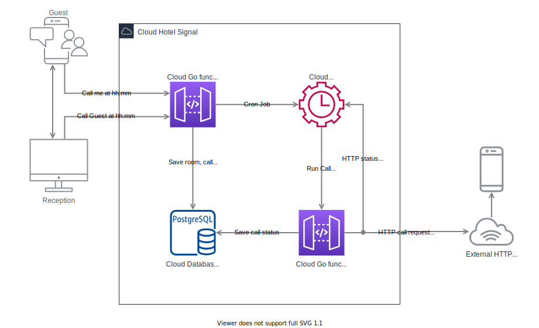
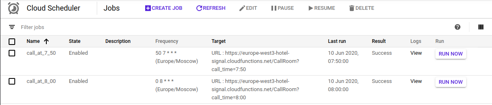
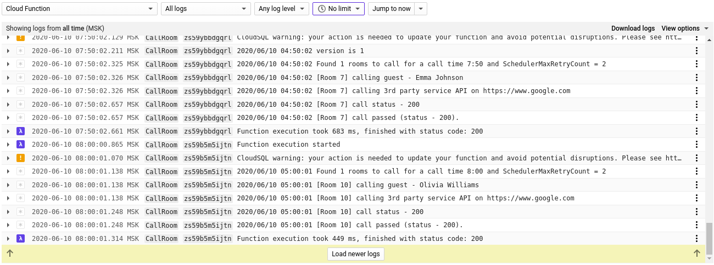
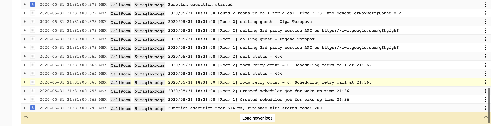

# Signal

Hotel wake up service.

Customer asks to wake them up at xx:yy and this what this service does.

Technologies used: Google Cloud Scheduler, Cloud SQL, Cloud Functions.

# Service Diagram



# Deploy

1. Setup Google Cloud Project and Cloud PostgreSQL.
2. Put your gcloud serviceaccount.json file into `cmd` directory.
3. Update environment variables in `cmd/env.sh` file:

```
export GOOGLE_APPLICATION_CREDENTIALS=../../hotel-signal-305abb7fcefa.json

# Google Cloud Postgres
export SIGNAL_PG_PROTO=unix
export SIGNAL_PG_ADDR=/cloudsql/hotel-signal:europe-west3:signals/.s.PGSQL.5432
export SIGNAL_PG_DB=signals
export SIGNAL_PG_USER=signals
export SIGNAL_PG_PASSWORD=********

export SIGNAL_GC_PROJECT=hotel-signal
export SIGNAL_GC_PROJECT_LOCATION=europe-west3
export SIGNAL_CALL_ROOM_ENDPOINT=https://$SIGNAL_GC_PROJECT_LOCATION-$SIGNAL_GC_PROJECT.cloudfunctions.net/CallRoom
export SIGNAL_SCHEDULER_LOCATION=projects/$SIGNAL_GC_PROJECT/locations/$SIGNAL_GC_PROJECT_LOCATION
export SIGNAL_SCHEDULER_TIMEZONE=Europe/Moscow
export SIGNAL_SCHEDULER_MAX_RETRY_COUNT=2
export SIGNAL_SCHEDULER_RETRY_PERIOD=1m
export SIGNAL_CALL_ENDPOINT=https://www.google.com
```

4. Deploy Google cloud functions with `cmd/deploy.all.sh` script as follows:

```
ayu@ayu-K73E://home/ayu/go/src/github.com/AYU-A/signal/cmd$ ./deploy.call.room.sh 
Deploying function (may take a while - up to 2 minutes)...done.                                                                              
availableMemoryMb: 128
entryPoint: CallRoom
environmentVariables:
  SIGNAL_CALL_ENDPOINT: https://www.google.com
  SIGNAL_CALL_ROOM_ENDPOINT: https://europe-west3-hotel-signal.cloudfunctions.net/CallRoom
  SIGNAL_GC_PROJECT: hotel-signal
  SIGNAL_GC_PROJECT_LOCATION: europe-west3
  SIGNAL_PG_ADDR: /cloudsql/hotel-signal:europe-west3:signals/.s.PGSQL.5432
  SIGNAL_PG_DB: signals
  SIGNAL_PG_PASSWORD: ********
  SIGNAL_PG_PROTO: unix
  SIGNAL_PG_USER: signals
  SIGNAL_SCHEDULER_LOCATION: projects/hotel-signal/locations/europe-west3
  SIGNAL_SCHEDULER_MAX_RETRY_COUNT: '2'
  SIGNAL_SCHEDULER_RETRY_PERIOD: 1m
  SIGNAL_SCHEDULER_TIMEZONE: Europe/Moscow
httpsTrigger:
  url: https://europe-west3-hotel-signal.cloudfunctions.net/CallRoom
ingressSettings: ALLOW_ALL
labels:
  deployment-tool: cli-gcloud
maxInstances: 10
name: projects/hotel-signal/locations/europe-west3/functions/CallRoom
runtime: go113
serviceAccountEmail: hotel-signal@appspot.gserviceaccount.com
sourceUploadUrl: https://storage.googleapis.com/gcf-upload-europe-west3-5c0dc7ec-0b95-4a71-be64-50b70a27640b/685be078-c7c9-4593-a446-0dcb1763b585.zip?GoogleAccessId=service-633178885576@gcf-admin-robot.iam.gserviceaccount.com&Expires=1591714922&Signature=RszdWDi9HqYHfIomjnP5zuh36zGGOvMoW230OwVpIv%2B%2Bo%2BqzTU3K7oKeH1ekrcryF2LLL2U558exM3kW5wJyE%2BrgCtqQzllNxuPLxpOguk2seYzOaE6zl2L5T0thPCq%2B%2FGQwnPaJZ%2FUFAiONAgwpuvhwfghMtaQcIMZk5apcqPQX70EPJuJ6YFFVAR6y3KvGwRxjeVFGLFM%2BRSU9iGjuq48J7bq07JCn0LsQGIojOQHWdFvB4lWXtb4Qv8NhpvwC1%2BSBYEypH2djTXxqWeAcgre6hjcK3xb8C%2FnB2TlQrwlxQzQgTF0UAwGAUtwG%2B8%2BpHlXU5J9PrY%2FTp6GYVpnfGg%3D%3D
status: ACTIVE
timeout: 60s
updateTime: '2020-06-09T14:33:47.863Z'
versionId: '1'

```

5. Simulate guest "call me" calls:

```
ayu@ayu-K73E:~/cmd$ curl --location --request POST 'https://europe-west3-hotel-signal.cloudfunctions.net/ScheduleCall' \
> --header 'Content-Type: application/json' \
> --data-raw '[
>     {
>         "firstname": "Noah",
>         "lastname": "Smith",
>         "retry_count": 2,
>         "call_time": "08:00",
>         "room_number": 4
>     },
>     {
>         "firstname": "Emma",
>         "lastname": "Johnson",
>         "retry_count": 1,
>         "call_time": "07:50",
>         "room_number": 7
>     },
>     {
>         "firstname": "Olivia",
>         "lastname": "Williams",
>         "retry_count": 1,
>         "call_time": "08:00",
>         "room_number": 10
>     }
> ]'
[
    {
        "room_number": 4,
        "firstname": "Noah",
        "lastname": "Smith",
        "call_time": "08:00",
        "retry_count": 2,
        "created": "2020-06-10T13:08:00.008038Z"
    },
    {
        "room_number": 7,
        "firstname": "Emma",
        "lastname": "Johnson",
        "call_time": "07:50",
        "retry_count": 1,
        "created": "2020-06-10T13:08:00.008038Z"
    },
    {
        "room_number": 10,
        "firstname": "Olivia",
        "lastname": "Williams",
        "call_time": "08:00",
        "retry_count": 1,
        "created": "2020-06-10T13:08:00.008038Z"
    }
]

```

6. Make sure jobs scheduled:



7. Make sure rooms called:



8. Make sure rooms rescheduled in case of call error (see SIGNAL_SCHEDULER_MAX_RETRY_COUNT and SIGNAL_SCHEDULER_RETRY_PERIOD in `cmd/env.sh`):



9. Have a nice day :)

# TODO

- Move to interfaces
- Add unit tests with https://github.com/stretchr/testify
- Improve deploy time
- More QA as obviously some bugs missed :)
